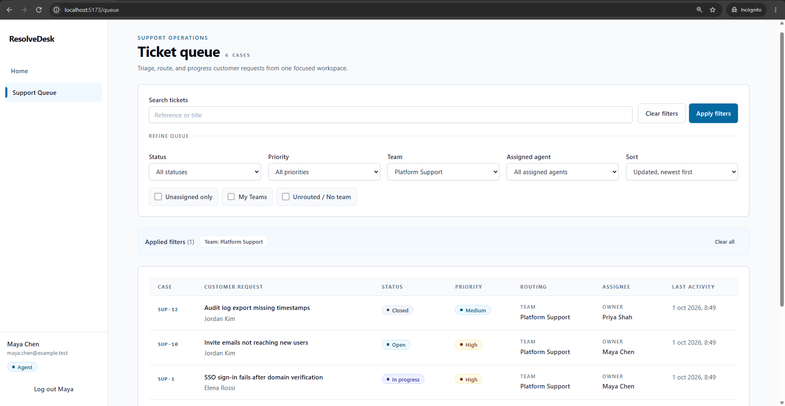
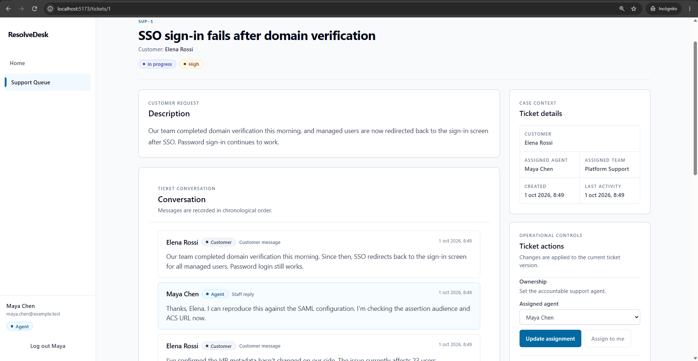
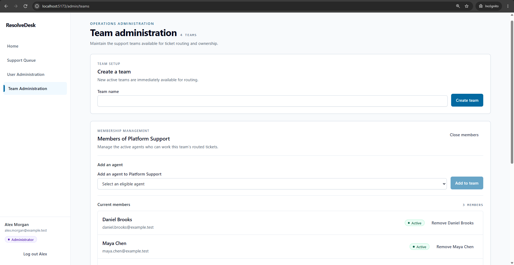
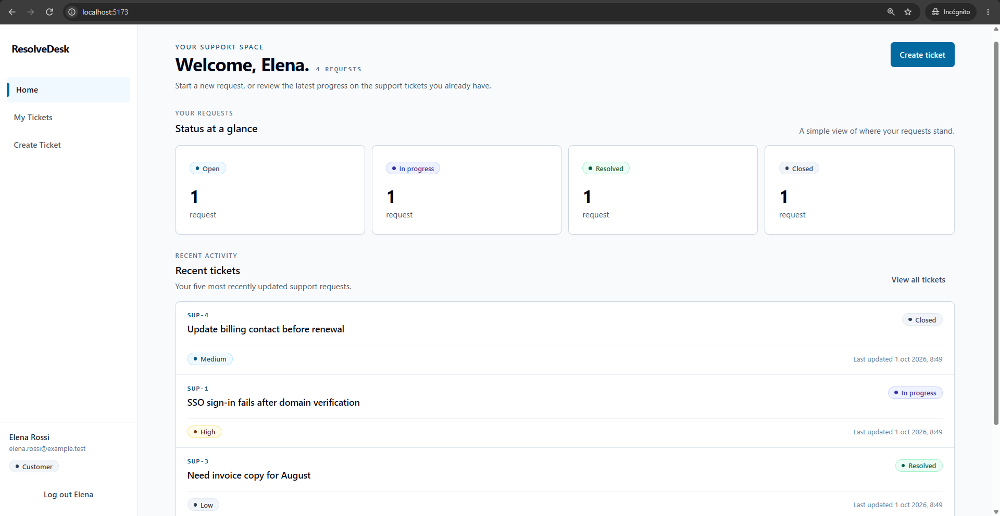

# ResolveDesk

ResolveDesk is a full-stack support-operations application built as a portfolio project with Java, Spring Boot, React, and TypeScript. It models the day-to-day workflow of receiving customer issues, triaging them in a shared queue, routing work to teams, assigning eligible agents, and retaining the conversation and audit trail with the ticket.

It is an implemented application, not a frontend prototype: the React client communicates with a Spring Boot REST API backed by MySQL, with server-side authorization, schema migrations, and automated verification.

## Product tour

### Support Queue — triage and ownership in one view

Agents and administrators work from a global queue with server-side status, priority, assignee, team, and search filters. Tickets can be routed to a support team and assigned to an eligible member of that team.



### Ticket Workspace — conversation alongside the operational record

Each ticket brings together the customer request, current workflow state, routing and assignment, immutable activity history, and customer-agent conversation.



### Team Administration — maintain routing eligibility

Administrators create and manage operational teams, control active status, and maintain current AGENT memberships without bypassing ticket-assignment safeguards.



### Customer Dashboard — a focused customer workspace

Customers can create and follow only their own support requests, review activity and messages, and reopen a resolved issue when further work is needed.



## What it demonstrates

- Role-aware support workflows for CUSTOMER, AGENT, and ADMIN users.
- A global support queue with server-side filtering, pagination, sorting, routing, and team-aware assignment.
- Ticket lifecycle management with optimistic locking and terminal, read-only CLOSED tickets.
- Immutable ticket-history events and comment records that preserve operational context.
- Administrator controls for user status/roles and support-team membership, guarded by workflow eligibility rules.
- A React/TypeScript client backed by a DTO-based Spring Boot REST API rather than mocked application state.

## Technology

| Area | Tools |
| --- | --- |
| Backend | Java 21, Spring Boot, Spring Security, Spring Data JPA, Bean Validation, Flyway, MySQL, OpenAPI |
| Frontend | React, TypeScript, React Router, Tailwind CSS, Vite |
| Testing | JUnit, Mockito, Spring Boot Test, Testcontainers, Vitest, Testing Library |
| Delivery | Docker Compose, Nginx, GitHub Actions |

## Engineering highlights

### Security and API boundary

Authentication uses server-managed sessions with CSRF protection. Authorization is enforced by the backend: customers can access only their own tickets, while staff access is role-based. Request and response DTOs define the HTTP boundary; JPA entities are not exposed by the REST API. Errors use a consistent Problem Details-style response with stable application codes.

### Workflow, routing, and auditability

New tickets start OPEN and progress through `OPEN → IN_PROGRESS → RESOLVED → CLOSED`; customers may reopen only their own resolved tickets. Narrow, versioned mutation requests prevent stale updates from silently overwriting newer work. Routing and assignment are separate: a routed ticket can be team-only, and an assigned agent must be active, have the AGENT role, and belong to its team when one is set.

Assignment, routing, priority, and lifecycle changes write immutable ticket-history events transactionally. Eligibility-changing operations use database locking around relevant users and teams, preventing concurrent administration changes from leaving an invalid assignment or team membership relationship.

### Data and verification

Flyway owns the schema, while Hibernate validates it rather than creating or updating it in production. The backend test suite covers workflow, authorization, comments, team operations, and concurrency safeguards. Focused Testcontainers coverage verifies Flyway migrations and Hibernate schema validation against MySQL 8, including representative V4-to-V7 upgrades.

## Run locally

Docker Compose is the simplest local setup. Copy the environment template, replace its placeholder values, and configure the bootstrap administrator values before starting the stack:

```powershell
Copy-Item .env.example .env
# Edit the local, ignored .env file.
docker compose up --build
```

The frontend is available at `http://localhost:5173` and the backend at `http://localhost:8080` by default. Compose starts MySQL, runs Flyway migrations through the application startup, and serves the frontend through Nginx.

For local frontend development, install dependencies and start Vite:

```powershell
npm --prefix frontend ci
npm --prefix frontend run dev
```

Non-Docker backend development requires Java 21, Maven, Node.js 22, and MySQL 8, with the required database and bootstrap-administrator environment variables available to the process.

## Optional demo dataset

For repeatable portfolio screenshots and local exploration, the optional [demo-data script](scripts/seed-demo-data.ps1) creates a fictional dataset through the real ResolveDesk HTTP API. See [demo-data setup and safety notes](docs/demo-data.md) for usage, accounts, and safeguards.

The documented `docker compose down -v` reset permanently removes the local MySQL volume. Use it only when intentionally discarding local database data.

## Testing and verification

Run these commands from the repository root:

```powershell
mvn -f backend/pom.xml test
mvn -f backend/pom.xml package
npm --prefix frontend run typecheck
npm --prefix frontend test
npm --prefix frontend run build
```

GitHub Actions runs the backend tests/package and frontend type check, tests, and production build on pushes and pull requests.

## Documentation

- [Architecture overview](docs/architecture.md)
- [REST API contract](docs/003-REST-api-contract.txt) and [team-based API additions](docs/007-v2-rest-api-addendum.md)
- [Team-based support-operations decision](docs/decisions/002-team-based-support-operations.md)
- [Demo dataset workflow](docs/demo-data.md)

When the local stack is running, the OpenAPI document is available at `http://localhost:8080/api-docs` and Swagger UI at `http://localhost:8080/swagger-ui`.

The project intentionally keeps notifications, attachments, SLAs, reporting, real-time updates, OAuth, and external integrations out of scope so the implemented support workflow remains focused.
